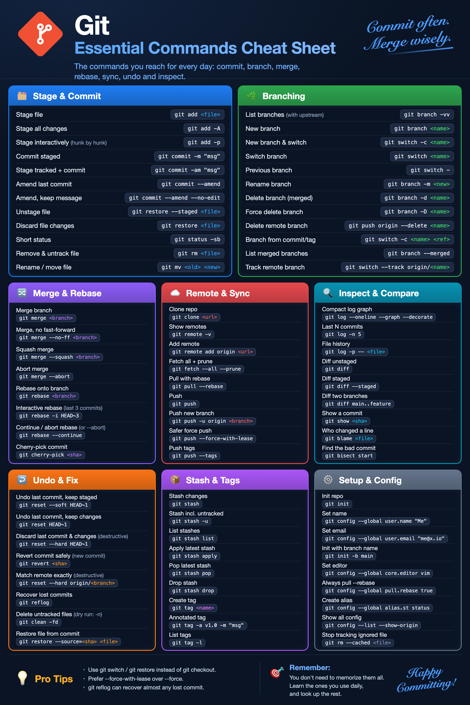

# Git Essential Commands

> Essential Git commands for everyday work: stage & commit, branching, merge & rebase, remotes, inspecting history, undoing mistakes, stash & tags, and config.

**Category:** VCS  
**Platform:** cross-platform  
**Tags:** `git` `vcs` `version-control` `source-control` `cli` `terminal` `commands` `commit` `branch` `merge` `rebase` `stash` `reset` `revert` `cherry-pick` `remote` `github` `gitlab` `cheatsheet`

## Stage & Commit

| Action | Shortcut / Command | Note |
|---|---|---|
| Stage file | `git add <file>` |  |
| Stage all changes | `git add -A` |  |
| Stage interactively | `git add -p` | hunk by hunk |
| Commit staged | `git commit -m "msg"` |  |
| Stage tracked + commit | `git commit -am "msg"` |  |
| Amend last commit | `git commit --amend` |  |
| Amend, keep message | `git commit --amend --no-edit` |  |
| Unstage file | `git restore --staged <file>` |  |
| Discard file changes | `git restore <file>` |  |
| Short status | `git status -sb` |  |
| Remove & untrack file | `git rm <file>` |  |
| Rename / move file | `git mv <old> <new>` |  |

## Branching

| Action | Shortcut / Command | Note |
|---|---|---|
| List branches | `git branch -vv` | with upstream |
| New branch | `git branch <name>` |  |
| New branch & switch | `git switch -c <name>` |  |
| Switch branch | `git switch <name>` |  |
| Previous branch | `git switch -` |  |
| Rename branch | `git branch -m <new>` |  |
| Delete branch (merged) | `git branch -d <name>` |  |
| Force delete branch | `git branch -D <name>` |  |
| Delete remote branch | `git push origin --delete <name>` |  |
| Branch from commit/tag | `git switch -c <name> <ref>` |  |
| List merged branches | `git branch --merged` |  |
| Track remote branch | `git switch --track origin/<name>` |  |

## Merge & Rebase

| Action | Shortcut / Command | Note |
|---|---|---|
| Merge branch | `git merge <branch>` |  |
| Merge, no fast-forward | `git merge --no-ff <branch>` |  |
| Squash merge | `git merge --squash <branch>` |  |
| Abort merge | `git merge --abort` |  |
| Rebase onto branch | `git rebase <branch>` |  |
| Interactive rebase | `git rebase -i HEAD~3` | last 3 commits |
| Continue / abort rebase | `git rebase --continue` | or --abort |
| Cherry-pick commit | `git cherry-pick <sha>` |  |

## Remote & Sync

| Action | Shortcut / Command | Note |
|---|---|---|
| Clone repo | `git clone <url>` |  |
| Show remotes | `git remote -v` |  |
| Add remote | `git remote add origin <url>` |  |
| Fetch all + prune | `git fetch --all --prune` |  |
| Pull with rebase | `git pull --rebase` |  |
| Push | `git push` |  |
| Push new branch | `git push -u origin <branch>` |  |
| Safer force push | `git push --force-with-lease` |  |
| Push tags | `git push --tags` |  |

## Inspect & Compare

| Action | Shortcut / Command | Note |
|---|---|---|
| Compact log graph | `git log --oneline --graph --decorate` |  |
| Last N commits | `git log -n 5` |  |
| File history | `git log -p -- <file>` |  |
| Diff unstaged | `git diff` |  |
| Diff staged | `git diff --staged` |  |
| Diff two branches | `git diff main..feature` |  |
| Show a commit | `git show <sha>` |  |
| Who changed a line | `git blame <file>` |  |
| Find the bad commit | `git bisect start` |  |

## Undo & Fix

| Action | Shortcut / Command | Note |
|---|---|---|
| Undo last commit, keep staged | `git reset --soft HEAD~1` |  |
| Undo last commit, keep changes | `git reset HEAD~1` |  |
| Discard last commit & changes | `git reset --hard HEAD~1` | destructive |
| Revert commit safely | `git revert <sha>` | new commit |
| Match remote exactly | `git reset --hard origin/<branch>` | destructive |
| Recover lost commits | `git reflog` |  |
| Delete untracked files | `git clean -fd` | dry run: -n |
| Restore file from commit | `git restore --source=<sha> <file>` |  |

## Stash & Tags

| Action | Shortcut / Command | Note |
|---|---|---|
| Stash changes | `git stash` |  |
| Stash incl. untracked | `git stash -u` |  |
| List stashes | `git stash list` |  |
| Apply latest stash | `git stash apply` |  |
| Pop latest stash | `git stash pop` |  |
| Drop stash | `git stash drop` |  |
| Create tag | `git tag <name>` |  |
| Annotated tag | `git tag -a v1.0 -m "msg"` |  |
| List tags | `git tag -l` |  |

## Setup & Config

| Action | Shortcut / Command | Note |
|---|---|---|
| Init repo | `git init` |  |
| Set name | `git config --global user.name "Me"` |  |
| Set email | `git config --global user.email "me@x.io"` |  |
| Init with branch name | `git init -b main` |  |
| Set editor | `git config --global core.editor vim` |  |
| Always pull --rebase | `git config --global pull.rebase true` |  |
| Create alias | `git config --global alias.st status` |  |
| Show all config | `git config --list --show-origin` |  |
| Stop tracking ignored file | `git rm --cached <file>` |  |

## Tips

- Prefer git switch / git restore (Git 2.23+) over the overloaded git checkout.
- Use --force-with-lease instead of --force when you must rewrite remote history.
- git reflog remembers almost everything: a commit is rarely truly lost.
- Replace <placeholders> with your own value; --global writes to ~/.gitconfig.

_Source: Generated from this file by tools/render_sheet.py; commands valid for Git 2.23+ (git switch / git restore)._

<!-- generated by `cs build` from sheet.json - do not edit -->
