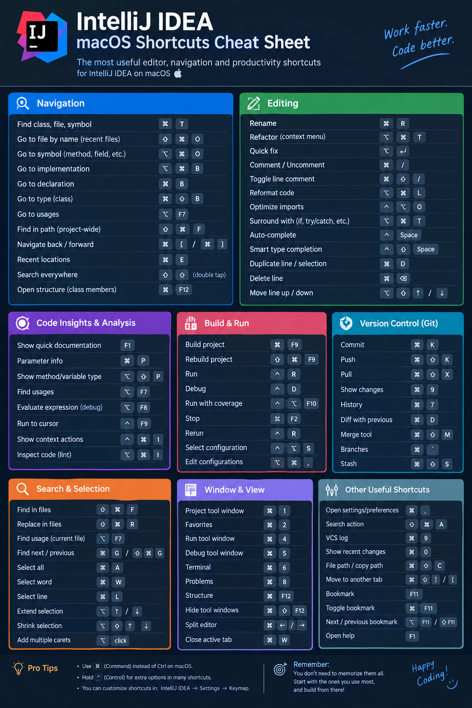

# IntelliJ IDEA macOS Shortcuts

> The most useful editor, navigation and productivity shortcuts for IntelliJ IDEA on macOS: navigation, editing, code insights, build & run, Git, search & selection, window management.

**Category:** IDE  
**Platform:** macOS  
**Tags:** `intellij` `idea` `jetbrains` `ide` `shortcuts` `keyboard` `hotkeys` `keymap` `macos` `navigation` `editing` `refactoring` `debugging` `git` `vcs` `productivity` `java` `kotlin`

## Navigation

| Action | Shortcut / Command | Note |
|---|---|---|
| Find class, file, symbol | `⌘T` |  |
| Go to file by name | `⇧⌘O` | recent files |
| Go to symbol | `⌥⌘O` | method, field, etc. |
| Go to implementation | `⌥⌘B` |  |
| Go to declaration | `⌘B` |  |
| Go to type | `⇧⌘B` | class |
| Go to usages | `⌥F7` |  |
| Find in path | `⇧⌘F` | project-wide |
| Navigate back / forward | `⌘[` / `⌘]` |  |
| Recent locations | `⌘E` |  |
| Search everywhere | `⇧⇧` | double tap |
| Open structure | `⌘F12` | class members |

## Editing

| Action | Shortcut / Command | Note |
|---|---|---|
| Rename | `⌘R` | ⚠️ JetBrains default keymap uses shift+f6 for Rename; cmd+r is Replace in file. |
| Refactor | `⌥⌘T` | context menu ⚠️ JetBrains default keymap uses ctrl+t for Refactor This; cmd+opt+t is Surround With. |
| Quick fix | `⌥↵` |  |
| Comment / Uncomment | `⌘/` |  |
| Toggle line comment | `⇧⌘/` |  |
| Reformat code | `⌥⌘L` |  |
| Optimize imports | `⌃⌥O` |  |
| Surround with | `⌥⌘T` | if, try/catch, etc. |
| Auto-complete | `⌃Space` |  |
| Smart type completion | `⌃⇧Space` |  |
| Duplicate line / selection | `⌘D` |  |
| Delete line | `⌘⌫` |  |
| Move line up / down | `⌥⇧↑` / `⌥⇧↓` |  |

## Code Insights & Analysis

| Action | Shortcut / Command | Note |
|---|---|---|
| Show quick documentation | `F1` |  |
| Parameter info | `⌘P` |  |
| Show method/variable type | `⌥⇧P` |  |
| Find usages | `⌥F7` |  |
| Evaluate expression | `⌥F8` | debug |
| Run to cursor | `⌃F9` |  |
| Show context actions | `⌃⌘1` |  |
| Inspect code | `⌥⌘I` | lint |

## Build & Run

| Action | Shortcut / Command | Note |
|---|---|---|
| Build project | `⌘F9` |  |
| Rebuild project | `⇧⌘F9` |  |
| Run | `⌃R` |  |
| Debug | `⌃D` |  |
| Run with coverage | `⌃⌥F10` |  |
| Stop | `⌘F2` |  |
| Rerun | `⌃R` | ⚠️ JetBrains default keymap uses cmd+r for Rerun. |
| Select configuration | `⌃⌥S` |  |
| Edit configurations | `⌥⌘,` |  |

## Version Control (Git)

| Action | Shortcut / Command | Note |
|---|---|---|
| Commit | `⌘K` |  |
| Push | `⇧⌘K` |  |
| Pull | `⇧⌘X` |  |
| Show changes | `⌘9` |  |
| History | `⌘7` |  |
| Diff with previous | `⌘D` |  |
| Merge tool | `⇧⌘M` |  |
| Branches | `⌘`` |  |
| Stash | `⇧⌘S` |  |

## Search & Selection

| Action | Shortcut / Command | Note |
|---|---|---|
| Find in files | `⇧⌘F` |  |
| Replace in files | `⇧⌘R` |  |
| Find usage | `⌥F7` | current file |
| Find next / previous | `⌘G` / `⇧⌘G` |  |
| Select all | `⌘A` |  |
| Select word | `⌘W` |  |
| Select line | `⌘L` |  |
| Extend selection | `⌥↑` / `⌥↓` |  |
| Shrink selection | `⌥⇧↑` / `⌥⇧↓` |  |
| Add multiple carets | `⌥click` |  |

## Window & View

| Action | Shortcut / Command | Note |
|---|---|---|
| Project tool window | `⌘1` |  |
| Favorites | `⌘2` |  |
| Run tool window | `⌘4` |  |
| Debug tool window | `⌘5` |  |
| Terminal | `⌘6` |  |
| Problems | `⌘8` |  |
| Structure | `⌘F12` |  |
| Hide tool windows | `⇧⌘F12` |  |
| Split editor | `⌘←` / `⌘→` |  |
| Close active tab | `⌘W` |  |

## Other Useful Shortcuts

| Action | Shortcut / Command | Note |
|---|---|---|
| Open settings/preferences | `⌘,` |  |
| Search action | `⇧⌘A` |  |
| VCS log | `⌘9` |  |
| Show recent changes | `⌘0` |  |
| File path / copy path | `⇧⌘C` |  |
| Move to another tab | `⇧⌘]` / `⇧⌘[` |  |
| Bookmark | `F11` |  |
| Toggle bookmark | `⌘F11` |  |
| Next / previous bookmark | `⌥F11` / `⇧F11` |  |
| Open help | `F1` |  |

## Tips

- Use Command (cmd) instead of Ctrl on macOS.
- Hold Control (ctrl) for extra options in many shortcuts.
- You can customize shortcuts in: IntelliJ IDEA > Settings > Keymap.
- You don't need to memorize them all. Start with the ones you use most, and build from there.

_Source: Own cheatsheet image (IntelliJ_IDEA.png), transcribed 2026-10-02_

<!-- generated by `cs build` from sheet.json - do not edit -->
